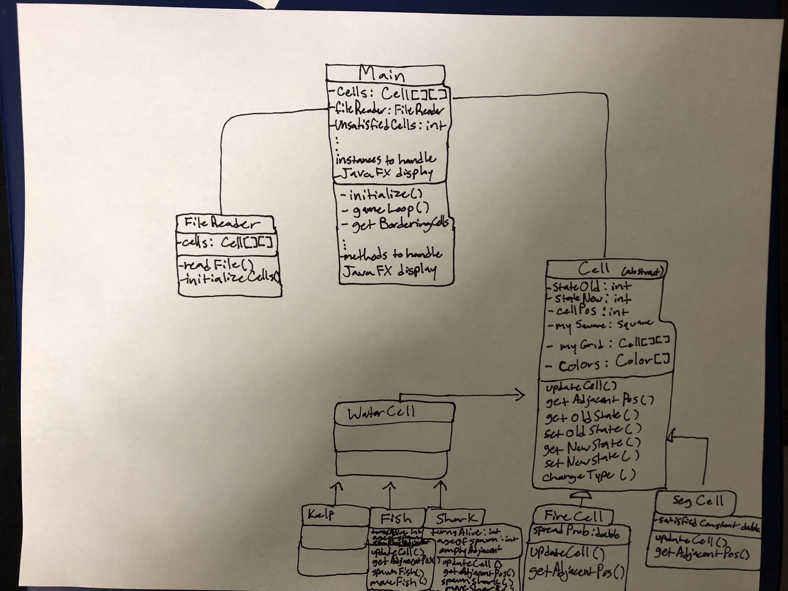

# Introduction

Problem: Create a JavaFX program with the ability to simulate 2-dimensional Cellular Automata that have varying rules and states (specifically Schelling's Model of Segregation, the Wa-Tor world model of predator-prey relationships, and the Spreading of Fire) that also has a user-friendly GUI.

Primary Design Goals:
* High flexibility in implementation of different cellular automata (should be able
to easily add a new type of CA simulation)
* Proper use of inheritance hierarchies in the implementation of different cell types
* High flexibility in setting the initial configuration of a given instance of the simulation (using an XML file)
* Main code running game loop should give a clear idea of the high level processes that are happening in order to advance the simulation
* Create a user-friendly GUI
* Consistency in coding style between group members
* Clear and regularly-updated documentation
* Proper use of git in developing new components

Primary Design Architecture:
**Open Components**
* Cellular Automaton simulation types
* Initial configuration of cells
* Specific behavior for handling update of cells from one frame to the next

**Closed Components**
* The process by which the main simulation ("game loop") is run
* Template for a general cell object
* User elements to control the GUI

# Overview

Our program is divided into two distinct parts, the Main class and the cellular.Cell superclass. 

The cellular.Cell superclass is an abstract class which is extended by three classes, each representing a different CA simulation. In this case, the classes SegCell, WatorCell, and FireCell will implement the CA models outlined in [Schelling's model of segregation](http://nifty.stanford.edu/2014/mccown-schelling-model-segregation/), [Wa-Tor World model of predator-prey relationships](http://nifty.stanford.edu/2011/scott-wator-world/), and [Spreading of Fire](http://nifty.stanford.edu/2007/shiflet-fire/), respectively.

The Main class handles reading in initial parameter settings from an XML file, the simulation in a game loop and graphical display of these Cells on a grid in JavaFX.

# User Interface

Components of the GUI through which the user interacts will include a series of horizontally laid out buttons with the following functions:

* **START** - Begin simulation specified through XML configuration file
* **PAUSE** - Pause current simulation
* **STOP** - Terminate current simulation
* **RESET** - Restart current simulation from initial state provided in XML configuration file
* **STEP** - Gives user ability to step through single frames of a CA simulation. If pushed while a simulation is already running it pauses the simulation.

Additionally, there will be input fields where the size of the grid used in the simulation can be specified from the GUI- a box for how many cells are in a row (x) and a box for how many cells there are in a column (y).

There will also be a slide bar that the user can slide representing how fast that the simulation will run.

See the attached picture for a visual layout of how we think these fields will be laid out on the main GUI: 

[Source: WaTor World Assignment page](https://web.archive.org/web/20180206040538/http://nifty.stanford.edu:80/2011/scott-wator-world/WatorWorld.htm)

**Erroneous Situations**
* Can't find XML configuration file
* XML configuration file is not configured correctly

We plan to inform the user of these erroneous situations by displaying an alert box in the center of the screen 

# Design Details

Main Class:
    
    Constructor:
        Launches Javafx application and calls FileReader class.
        Retrieves Array of Arrays of cell objects and color designations from FileReader.
        Calls initialize.
        Launches gameloop
    

    Fields:
        1. Array of Arrays of cell objects - passed from 
        2. FileReader object     
        3. int unsatisfiedCells - records the number of cells that aren't current satisfied    

        
    Behaviors:
        1. initialize - sets up Javafx display adds elements to group
        2. gameloop - checks if game is over otherwise calls update on every cell
        3. getBordering cells - returns the cells that are bording a passed coordinate 
        

FileReader Class:

    Constructor:
        Takes file path
        Creates new java.io file
        Reads in information
        Initialalize cells
        
    Fields:
        1. Cells - array of array containing cells

cellular.Cell abstract Class:

    Constructor:
        Takes as parameters a state, cell position, square object, myGrid.
        Initializes both state fields with state, cell position with the cell position, and array of arrays with mygrid.

    Fields:
        1. stateOld - holds int state before update call
        2. stateNew - holds int state after update call
        3. cellPos - holds cell position
        4. mySquare - hold square object
        5. myGrid - array of arrays holding Cells
        6. pubic static final array mapping colors to types
        
    Behaviors:
        1. abstract updateCell
        2. abstract getAdjacentPos
        3. getOldState - returns field
        4. getNewState - returns field
        5. setOldState - changes field
        6. setNewState - changes field
        7. changeType - changes type and color
        
SegCell Class

    Constructor:
        Takes as parameters a state, cell position, square object, grid, and satisfied constant.
        Extends superclass.
        Calls super.
        Sets constant
    
    Fields:
        1. public static final double satisfiedConstant - holds the percentage required to be satisfied
        2. myGrid - array of array of Cells
    
    Behaviors:
        1. override updateCell - takes as parameters an arraylist of SegCell objects. 
        Loops over the objects to determine if the cell is satisfied.
        If it isn't calls getDestination and flips the states of the cells
        
        2. override getAdjacentPos - returns arraylist of adjacent cell positions.
        Cells at the borders return less than 4 adjacent cells.
        3. getDestination - does a breadth first search to find the nearest empty cell and returns the position of the cell
        
FireCell Class:
    
    Constructor:
        Takes as parameters a state, cell position, square object, grid, and spread probability.
        Extends superclass.
        Calls super.
        Sets probability
    
    Fields:
        1. public static final double spreadProb - holds the probability of fire spreading from one cell to the next
    
    Behaviors:
        1. override updateCell - takes as parameters an arraylist of FireCell objects. 
        Loops over the objects to determine if the cell catches fire. 
        Also handles cases where the tree is already burning or there is no tree. 
        If the tree catchs fire or burns down calls updateType.
        2. override getAdjacentPos - returns arraylist of adjacent cell positions.
        Cells at the borders return less than 4 adjacent cells.
        
WaterCell Class:
    
    Constructor:
        Takes as parameters a state, cell position, square object, grid.
        Extends superclass.
        Calls super.cells.
        
Shark Class:

    Constructor:
        Takes as parameters a state, cell position, square object, grid, and ageForSpawn
        Extends superclass.
        Calls super.
    
    Fields:
        1. turnsAlive - holds number of turn shark has survived
        2. public static final int ageOfSpawn - number of turn shark needs to be alive to spawn a new shark
        3. emptyAdjacent - filled with empty adjacent cells
    
    Behaviors:
        1. override updateCell - takes as parameters an arraylist of cellular.Cell objects. 
        Loops over the objects to check for fish to eat
        Populates emptyAjacent
        Calls spawn shark
        Calls move shark
        2. override getAdjacentPos - returns arraylist of adjacent cell positions.
        Cells at the borders loops to cells on the opposite side of the map
        3. spawnShark - if shark has been alive long enough finds empty adjacent cell and and spawns new 
        4. moveShark - if empty adjacent cell moves shark and resents current cell

Fish Class:

    Constructor:
        Takes as parameters a state, cell position, square object, grid, and ageForSpawn
        Extends superclass.
        Calls super.
        
    Fields:
        1. turnsAlive - holds number of turn fish has survived
        2. public static final int ageOfSpawn - number of turn shark needs to be alive to spawn a new fish
        3. emptyAdjacent - filled with empty adjacent cells
    
    Behaviors:
        1. override updateCell - takes as parameters an arraylist of cellular.Cell objects. 
        Loops over the objects to check for kelp to eat
        Populates emptyAjacent
        Calls spawn fish
        Calls move fish
        2. override getAdjacentPos - returns arraylist of adjacent cell positions.
        Cells at the borders loops to cells on the opposite side of the map
        3. spawnFish - if fish has been alive long enough finds empty adjacent cell and and spawns new 
        4. moveFish - if empty adjacent cell moves shark and resents current cell

Kelp Class:

    Constructor:
        Takes as parameters a state, cell position, square object, grid.
        Extends superclass.
        Calls super.
    

# Design Considerations

One of our design considerations dealt with making subclasses of WaterCell. In other CAs, the states of a cell are relatively similar in implementation to one another, though for WaterCell, the kelp, fish, and shark states behave quite differently. While keeping the hierarchy of each CA similar to one another would maintain parallel structure, keeping all of the states of WaterCell in one class would lead to bloated methods with a number of if-else statements dependent upon the WaterCell state. We decided that unlike the other classes, extending WaterCell would best benefit design and help us to avoid code smells.

Another design consideration that we debated was the existence of a "Grid" class, whose function would be to manage the array(s) of cellular.Cell objects comprising the simulation. Arguments in favor of the Grid class included that it would be able to access all cellular.Cell objects in the simulation without the cellular.Cell objects themselves having to perform interactions with all of the other cellular.Cell objects. This would allow for efficient management procedures on the arrays of cellular.Cell objects. However, it was realized that this might introduce unhealthy two-way dependencies between the Grid and cellular.Cell class that might complicate its existence. Additionally, some of the different types of CA simulations might not require the functionalities that we would consider giving to the Grid class, such as an ability to relocate cells (from the rules of the Segregation simulation). Thus, for the moment we have decided not to implement a Grid class, but it is acknowledged that there are some possible benefits that could be reaped by doing so.

# Team Responsibilities

Jonathan will be responsible for creating the cellular.Cell class and its subclasses.

Max will be responsible for implementing the aspects of the Main class dealing with visualization.

Ryan will be responsible for creating the configuration of the XML files for a simulation and the accompanying code for using these configuration files to generate the initial simulation layout and with helping in laying out the Main class (visualization).

Each team member will provide updates to the team about his progress and any difficulties he may have encountered.